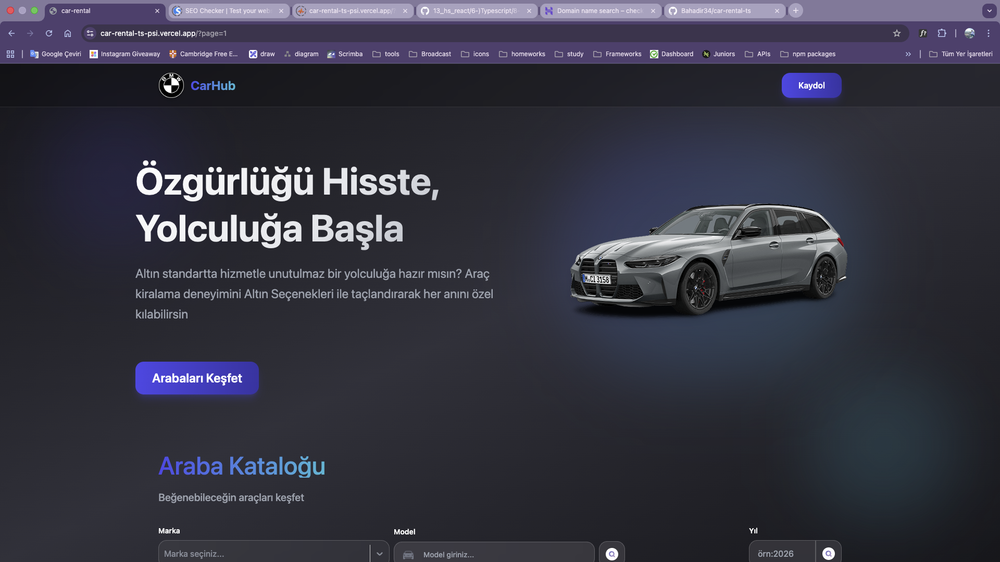
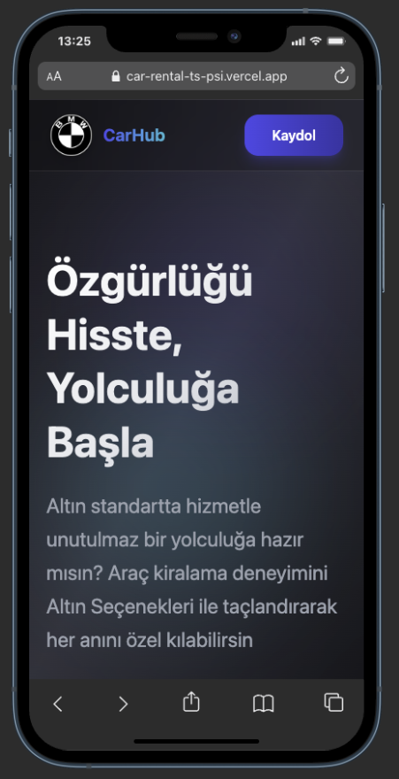

# Rental Car Listing Application

Rental Car application is aiming to meet clients who want to search about rental cars and provider. There are all cars and tehir models around the world. Rental Car Prices are defined automaticaly by application according to cars' properties.Clients can reach Rental Car Listing Application either mobile and web browser.

## Properties and Used Techs

- Responsive Modern UI
  - React (Component based design)
  - Tailwind
  - React Select
  - Motion (For animations)
- Coding Tools
  - Typescript (Type safe coding)
  - fetch api
  - React Router & React Router Dom (Handling page system)
  - React Paginate (Listing method of cars)

## Reach Application & Be a Contributer

Open your terminal and type below :

```bash
cd desktop
git clone https://github.com/Bahadir34/car-rental-ts.git
```

After clone the repo then you can run such below :

```bash
npm i
npm run dev
```

## Project Views





## Licence

This project is developed for educational purposes, so all developers who want to be a contributer for this project, they may join it.
